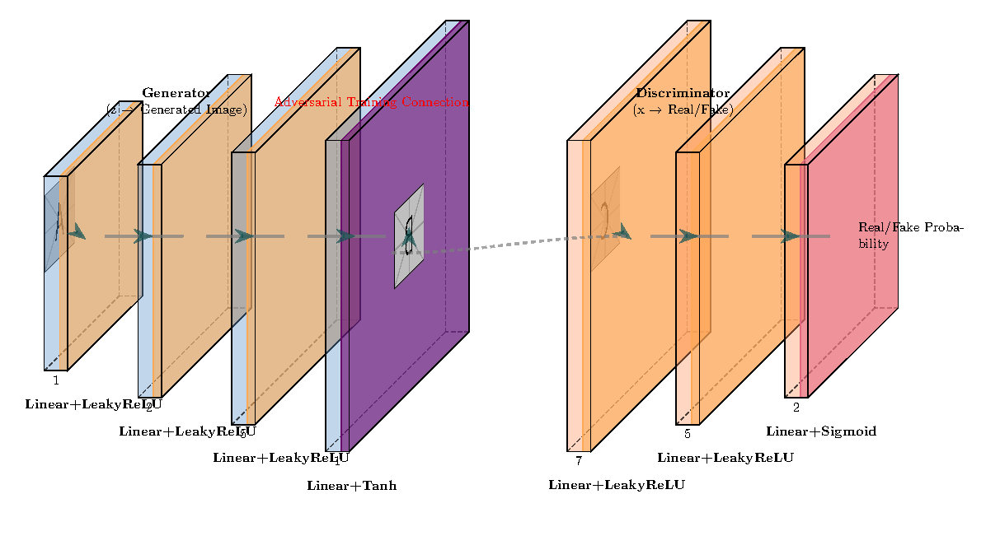
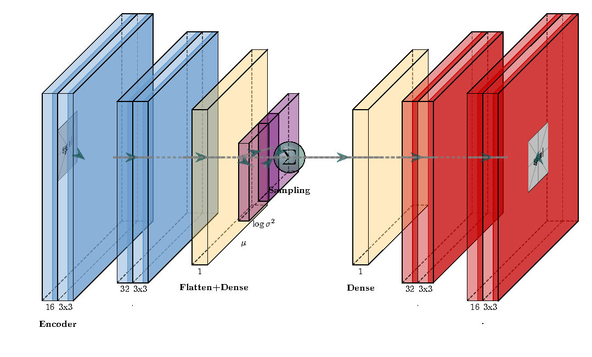

# 🧠 Deep Generative Models: GANs & VAEs Implementation

[](https://python.org)
[](https://pytorch.org)
[](https://jupyter.org)

A comprehensive implementation of **Generative Adversarial Networks (GANs)** and **Variational Autoencoders (VAEs)** for image generation and anomaly detection, developed as part of a Generative AI coursework.

## 🎯 Project Overview

This repository demonstrates the power of deep generative models through three main applications:

1. **🖼️ Image Generation with GANs** - Generate realistic MNIST digits and Fashion-MNIST items
2. **🔄 Image Reconstruction with VAEs** - Learn latent representations for image reconstruction and generation
3. **⚠️ Anomaly Detection** - Use VAEs for detecting anomalies in industrial sensor data

## 📂 Repository Structure

```
📦 generative-ai-models/
├── 📓 l200961_A1.ipynb           # Main notebook with complete implementation
├── 📓 my_save_the_world.ipynb    # VAE-based anomaly detection for predictive maintenance
├── 📊 data/                      # Datasets directory
│   ├── MNIST/                    # MNIST digits dataset
│   ├── FashionMNIST/            # Fashion-MNIST dataset
│   └── microsoft-azure-predictive-maintenance/  # Industrial sensor data
├── 📋 l200961_A1_report.pdf     # Detailed technical report
├── 🖼️ GAN.jpg, VAE.jpg          # Architecture diagrams
└── 📄 README.md                 # This file
```

## 🚀 Features

### 🎨 Generative Adversarial Networks (GANs)
- **Generator**: Multi-layer neural network that creates realistic images from random noise
- **Discriminator**: Adversarial network that distinguishes real from generated images
- **Training**: Implements the minimax game between generator and discriminator
- **Applications**: 
  - General MNIST digit generation
  - Specific digit generation (e.g., digit "1" for ID: 20L-0961)
  - Fashion-MNIST shoe generation

### 🔍 Variational Autoencoders (VAEs)
- **Encoder**: Convolutional layers mapping images to latent distributions
- **Decoder**: Transposed convolutions reconstructing images from latent space
- **Reparameterization Trick**: Enables gradient flow through stochastic sampling
- **Applications**:
  - MNIST digit reconstruction and generation
  - Fashion-MNIST item processing
  - Latent space visualization with t-SNE

### 🛠️ Anomaly Detection System
- **Industrial Application**: Predictive maintenance using Microsoft Azure dataset
- **Sensor Data Processing**: Multi-variate time series analysis (pressure, rotation, voltage, vibration)
- **VAE-based Detection**: Reconstruction error as anomaly score
- **Visualization**: Real-time anomaly highlighting across multiple sensor channels

## 📊 Datasets

| Dataset | Type | Size | Classes | Application |
|---------|------|------|---------|-------------|
| MNIST Digits | Grayscale Images | 70K | 10 | Digit generation & reconstruction |
| Fashion-MNIST | Grayscale Images | 70K | 10 | Fashion item generation |
| Azure Predictive Maintenance | Time Series | Variable | N/A | Anomaly detection |

## 🏗️ Model Architectures

### GAN Architecture

```
Generator: Noise(100) → FC(256) → FC(512) → FC(1024) → FC(784) → Reshape(28×28)
Discriminator: Image(784) → FC(512) → FC(256) → FC(1) → Sigmoid
```

### VAE Architecture

```
Encoder: Image(28×28) → Conv2D → Conv2D → FC → μ, σ²
Decoder: Latent(z) → FC → ConvTranspose2D → ConvTranspose2D → Image(28×28)
```

## 📈 Key Results

- **GAN Training**: Successfully generates diverse and realistic digits/fashion items
- **VAE Latent Space**: Clear clustering of different classes in 2D t-SNE visualization
- **Anomaly Detection**: Effective identification of sensor anomalies with 98th percentile threshold
- **Training Efficiency**: GPU-accelerated training with comprehensive loss tracking

## 🛠️ Installation & Usage

### Prerequisites
```bash
pip install torch torchvision matplotlib numpy pandas scikit-learn opendatasets
```

### Quick Start
1. **Clone the repository**
2. **Open the main notebook**: `l200961_A1.ipynb`
3. **Run cells sequentially** for complete implementation
4. **For anomaly detection**: Use `my_save_the_world.ipynb`

### Running Individual Components

#### GAN Training
```python
# Initialize models
generator = Generator(latent_dim=100)
discriminator = Discriminator()

# Train on MNIST
train_loop(dataloader, discriminator, generator, d_optimizer, g_optimizer, criterion, latent_dim, device)
```

#### VAE Training
```python
# Initialize VAE
model = VAE(latent_dim=10)

# Train and generate
train(epochs=20)
generate_images(10)
```

#### Anomaly Detection
```python
# Load sensor data and train VAE
vae = VAE(input_dim, LATENT_DIM)
train_vae(vae, dataloader, optimizer)

# Detect anomalies
anomaly_scores = detect_anomalies(vae, dataloader)
```

## 📊 Performance Metrics

- **GAN Loss Convergence**: Generator and Discriminator losses stabilize after ~50 epochs
- **VAE Reconstruction**: Low reconstruction error with clear latent space structure
- **Anomaly Detection**: High sensitivity with minimal false positives using reconstruction error
- **Anomaly Visualization**: Real-time plotting of sensor data with highlighted anomalies:
- 

## 🎓 Educational Value

This project demonstrates:
- **Deep Learning Fundamentals**: Neural network architectures and training procedures
- **Generative Modeling**: Understanding of different approaches to data generation
- **Practical Applications**: Real-world use cases in computer vision and industrial IoT
- **Research Implementation**: Translation of theoretical concepts to working code

## 📋 Technical Report

For detailed methodology, experimental setup, and results analysis, refer to the comprehensive technical report: `l200961_A1_report.pdf`

## 🤝 Contributing

This is an academic project, but suggestions and improvements are welcome! Feel free to:
- Report issues
- Suggest optimizations
- Propose new applications

## 📜 License

This project is for educational purposes. Please cite appropriately if using for academic work.

---

*"Generating the future, one neural network at a time"* 🚀
